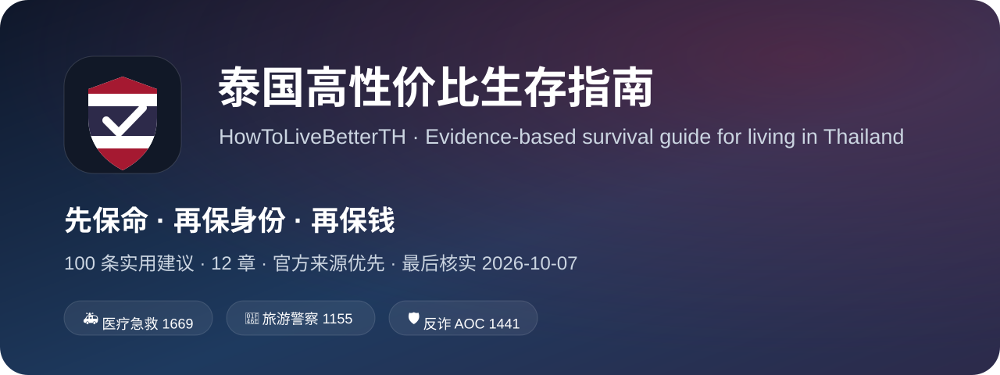

<p align="center"></p>

# 🇹🇭 泰国高性价比生存指南 · HowToLiveBetterTH

<p>
  
  
  
  
  
</p>

> 用尽量少的钱、时间和精力，降低在泰国生活时的 **死亡、违法、身份失效、被骗和大额损失** 风险。

**V0.1 · 100 条 · 最后核实：2026-10-07**

这不是旅游攻略，也不是“曼谷哪里便宜”的清单。它面向在泰国居住、工作、学习、长期停留或反复往返的人，优先处理后果最大的风险：**生命安全 → 合法身份 → 人身自由 → 金钱 → 时间与精力**。

- 条目总数：**100**
- 证据等级：A 40 / B 14 / C 46
- 性价比：极高 74 / 高 26
- 信息源优先级：**泰国政府官网 / WHO / 法规与官方系统 > 其他来源**
- 在线检索页：`index.html` 会直接读取 `book/*.md`，发布 GitHub Pages 后即可使用

## 🚨 先保存这张救命卡

| 场景 | 电话 |
|---|---:|
| 警察 / 紧急治安 | **191** |
| 火警 / 灾害（曼谷） | **199** |
| 医疗急救 | **1669** |
| 旅游警察 / 外语协助 | **1155** |
| 线上诈骗协调中心 AOC | **1441** |

> 紧急号码请以你所在地区最新官方信息为准。来源见 [BMA Safety](https://invest.bangkok.go.th/safety-2/)、[Tourist Police](https://www.touristpolice.go.th/contact-us)、[NIEM](https://emsdispute.niems.go.th/)、[BOT 反诈](https://www.bot.or.th/en/fraud/fraud-measure-development.html)。

## 只想先做 15 件事

1. 存下 **191 / 199 / 1669 / 1155 / 1441**。
2. 把 **停留许可、90 天报到、护照、工作许可、保险** 全部设到期提醒。
3. 不逾期停留；90 天报到不等于延长停留许可。
4. 搬家后确认住宿方完成 **TM30**，并自己保留凭证。
5. 出境前确认自己的身份是否需要 **Re-entry Permit**。
6. 外国人工作前确认 **工作许可 + 实际工作范围 + 保留职业清单**。
7. 能不骑摩托就不把摩托当默认交通工具；骑就戴合格头盔。
8. 确认自己的驾驶证件在泰国被认可。
9. 银行账户不借给任何人“过账”；被骗立即联系银行和 **AOC 1441**。
10. 每年自己累计在泰天数；接近/达到 **180 天** 就重新检查税务居民问题。
11. 租房交钱前看完整合同；入住当天拍完整房况。
12. 雨季使用驱蚊产品，每 7 天清理一次积水。
13. 被狗猫等哺乳动物咬抓后，立刻用肥皂和水冲洗 **10–15 分钟** 并就医。
14. 高温出现意识异常或明显高热时，先快速降温并拨 **1669**。
15. 用 **Air4Thai** 看 PM2.5；空气差时减少高强度户外活动。

## 🧭 怎么读

这不是任务清单。先筛“极高性价比”，再按你的身份筛选：在泰工作、长期居民、租房、驾驶、跨境收入等。`index.html` 直接读取 12 个章节文件，并提供关键词、章节、证据等级、性价比、收益类型和政策波动筛选。

### 证据等级

- **A：** 泰国法律/政府规则、官方系统明确要求，或 WHO/官方报告给出明确事实、数字与行动要求。
- **B：** 官方公共健康/安全指导，或有较强证据但难直接量化个人收益。
- **C：** 低成本实务规则。它通常是为了降低系统性失误，不能冒充法律结论或医学定论。

### 成本标签

- **钱：** `0 / 少 / 多`
- **时间：** `少 / 中 / 多`
- **毅力：** `否 / 些 / 是`
- **政策波动：** `低 / 中 / 高`。波动越高，越应该先看“最后核实日期”和官方原文。

## 📚 目录

- [00. 先保命：紧急情况](book/00.md) — 10 条
- [01. 合法留在泰国：身份与移民](book/01.md) — 12 条
- [02. 合法工作：工作许可与职业边界](book/02.md) — 9 条
- [03. 别死在路上：交通与驾驶](book/03.md) — 11 条
- [04. 租房别吃暗亏：合同、押金和证据](book/04.md) — 9 条
- [05. 别把钱和账户送给骗子：银行与反诈](book/05.md) — 10 条
- [06. 税务与财务记录：住得久就要算清楚](book/06.md) — 8 条
- [07. 热带健康：登革热、狂犬病和高温](book/07.md) — 12 条
- [08. 空气、火灾与环境风险](book/08.md) — 8 条
- [09. 手机、账号与证件备份](book/09.md) — 5 条
- [10. 消费、纠纷与证据](book/10.md) — 3 条
- [11. 长期生活系统：让低级错误自动消失](book/11.md) — 3 条


## 🧱 项目原则

1. **先保命，再保身份，再保钱。** 性价比排序优先于知识分类。
2. **写明成本和收益。** 不写“注意安全”这类没有动作的空话。
3. **官方原文优先。** 法规、移民、税务、劳动、银行等制度问题优先只引用主管机关原文。
4. **区分事实和建议。** “官方要求什么”和“我们建议你怎么降低失误”分开写。
5. **所有易变规则写核实日期。** 旧攻略不自动等于今天仍然有效。
6. **不替代专业服务。** 医疗、法律、税务和移民个案可能需要医生、律师、会计师或持牌/正式服务机构复核。

## 🗂️ 项目结构

```text
book/                 # 12 个章节，100 条完整条目
data/sources.json     # 来源表
tools/check-links.mjs # 链接检查
index.html            # 零依赖单页检索器，直接解析 book/*.md
CONTRIBUTING.md       # 贡献规则
CREDITS.md            # 致谢与许可说明
```

## 🙏 与《高性价比人生指南》的关系

本项目的 **“成本 → 说人话 → 收益 → 证据等级 → 来源”** 组织方式，受到 [eternity4719/HowToLiveBetter](https://github.com/eternity4719/HowToLiveBetter) 启发。

本仓库不是该项目的翻译，也不是把中国制度内容替换几个地名。**泰国正文重新研究、重新撰写**，并额外加入：适用身份、政策波动、最后核实日期。

原项目 2026-09-29 起：正文 CC BY 4.0、代码 MIT。本项目在 `CREDITS.md` 中保留明确致谢。

## 📄 许可

- 本项目原创正文：**CC BY 4.0**（见 `LICENSE-CONTENT.md`）
- 本项目代码：**MIT**（见 `LICENSE-CODE`）

## 🤝 贡献

欢迎提交 Issue / PR，尤其欢迎：泰语原文核对、最新法规更新、失效链接修复、英文/泰文版本。

提交前请先读 [CONTRIBUTING.md](CONTRIBUTING.md)。
